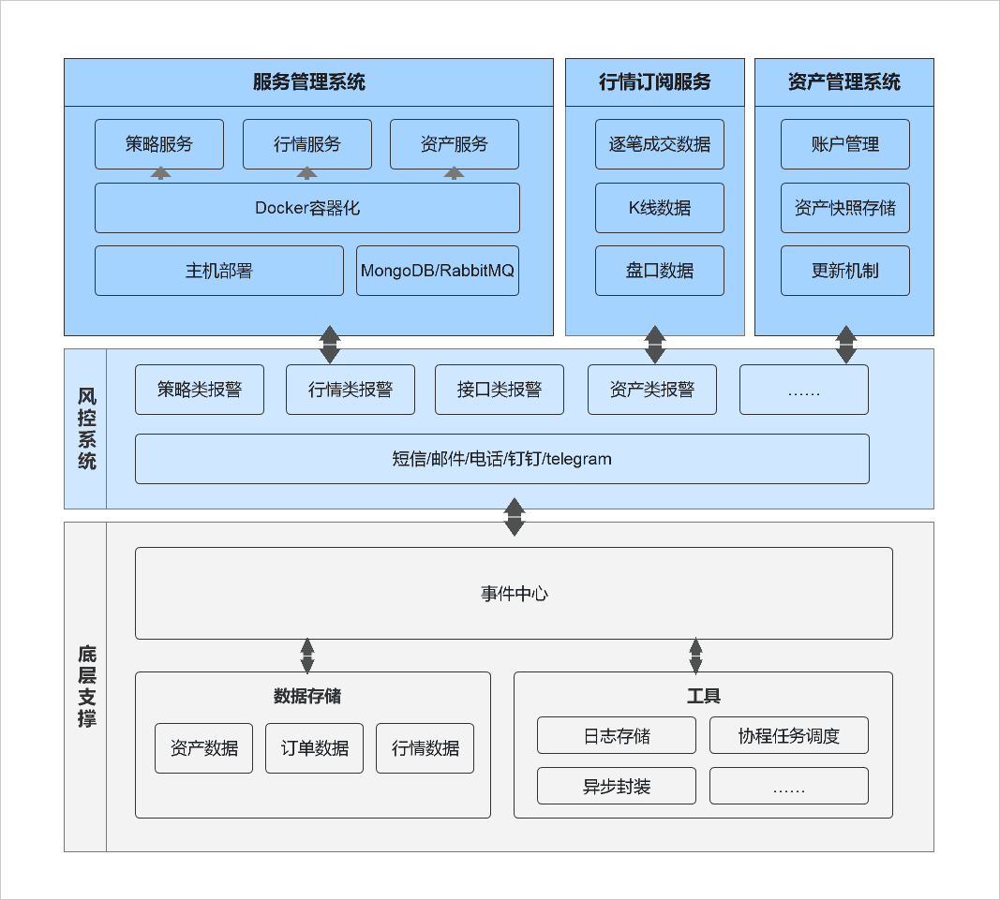
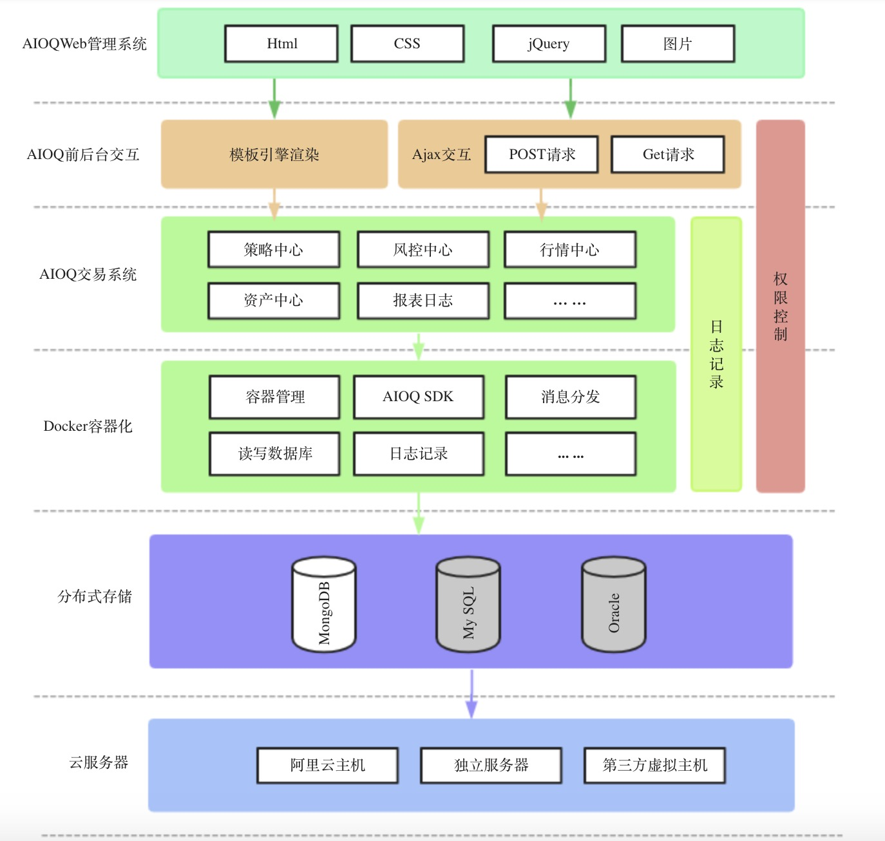

## AIOQuant

`AIOQuant` 是一套使用 `Python` 语言开发的 `异步事件驱动` 的 `量化交易 ` / `做市` 系统，它被设计为适应中高频策略的交易系统，
底层封装了操作系统的 `aio*库` 实现异步事件循环，业务层封装了 `RabbitMQ消息队列` 实现异步事件驱动，再加上 `Python` 语言的简单易用，
它非常适用于数字货币的高频策略和做市策略开发。

`AIOQuant` 同时也被设计为一套完全解耦的量化交易系统，其主要模块包括 `行情系统模块`、`资产系统模块`、`交易系统模块`、`风控系统模块`、`存储系统模块`，
各个模块都可以任意拆卸和组合使用，甚至采用不同的开发语言设计重构，模块之间通过 `RabbitMQ消息队列` 相互驱动，所以不同模块还可以部署在不同的进程，
或不同服务器。

`AIOQuant` 提供了简单而强大的功能：
- 基于 [Python Asyncio](https://docs.python.org/3/library/asyncio.html) 原生异步事件循环，处理更简洁，效率更高；
- 跨平台（Windows、Mac、Linux），可任意私有化部署；
- 任意交易所的交易方式（现货、合约）统一，相同策略只需要区别不同配置，即可无缝切换任意交易所；
- 所有交易所的行情统一，并通过事件订阅的形式，回调触发策略执行不同指令；
- 支持任意多个策略协同运行；
- 支持任意多个策略分布式运行；
- 毫秒级延迟（10毫秒内，一般瓶颈在网络延迟）；
- 提供任务、监控、存储、事件发布等一系列高级功能；
- 定制化Docker容器，分布式配置、部署运行；
- 量化交易Web管理系统，通过管理工具，轻松实现对策略、风控、资产、服务器等进程或资源的动态管理；

- `AIOQuant` 交易系统各大模块如下：
<p>
  
</p>

- `AIOQuant` 分布式管理交易系统
<p>
  
</p>


### 框架依赖

- 运行环境
	- python 3.5.3 或以上版本

- 依赖python三方包
	- aiohttp>=3.2.1
	- aioamqp>=0.13.0
	- motor>=2.0.0 (可选)

- RabbitMQ服务器
    - 事件发布、订阅

- MongoDB数据库(可选)
    - 数据存储


### 安装
使用 `pip` 可以简单方便安装:
```text
pip install aioquant
```


### Demo使用示例

- 推荐创建如下结构的文件及文件夹:
```text
ProjectName
    |----- docs
    |       |----- README.md
    |----- scripts
    |       |----- run.sh
    |----- config.json
    |----- src
    |       |----- main.py
    |       |----- strategy
    |               |----- strategy1.py
    |               |----- strategy2.py
    |               |----- ...
    |----- .gitignore
    |----- README.md
```

- 快速体验 [Demo](example/demo) 示例


- 运行
```text
python src/main.py config.json
```


### 使用文档
- [Python Asyncio](https://docs.python.org/3/library/asyncio.html)
- [安装RabbitMQ](docs/others/rabbitmq_deploy.md)
- [日志打印](docs/others/logger.md)
- [定时任务](docs/others/tasks.md)

